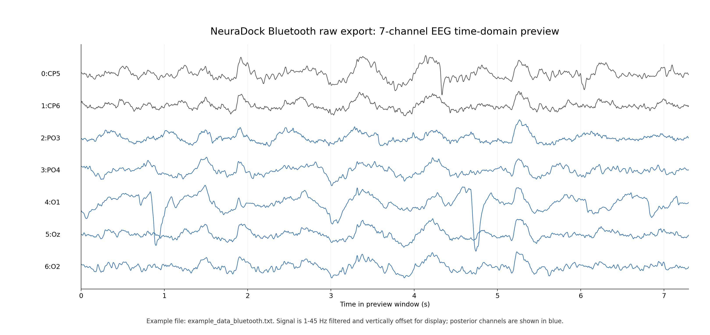
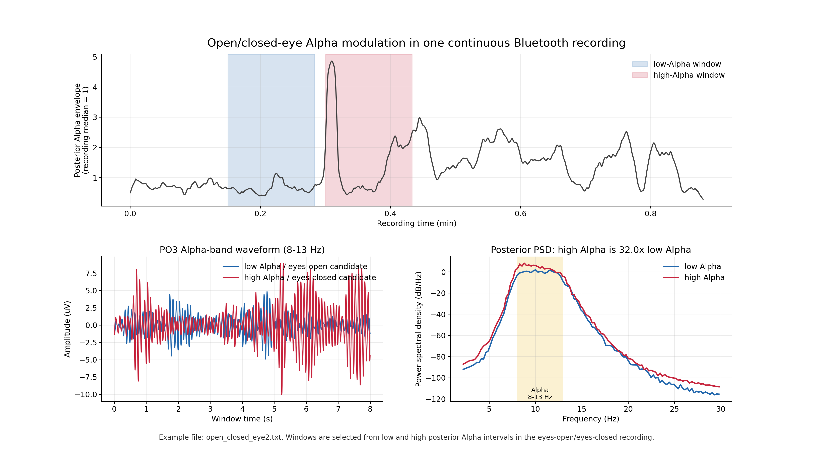

# NeuraDock EEG Workstation Data

> Public sample EEG recordings for testing NeuraDock parsing, signal quality,
> Alpha dynamics, and visual cognitive-load workflows.

This repository contains data collected with the NeuraDock 7-channel
dry-electrode EEG workstation. It is meant to help users answer three practical
questions before building algorithms:

1. Can I parse NeuraDock Bluetooth and USB text exports?
2. Can the device capture interpretable multi-channel EEG and posterior Alpha?
3. Can an Alpha-based feature remain trustworthy during real task and long
   naturalistic recordings?

Analysis code lives in the software repositories. This repository is data,
figures, manifests, and documentation.

## First Look: 7-Channel Bluetooth EEG



This preview uses `example_data_bluetooth.txt`. The signal is filtered to
`1-45 Hz` and vertically offset so users can immediately see the seven-channel
time-domain structure. Posterior channels are highlighted in blue because they
are used for Alpha and visual-load examples.

## Classic Demo: Eyes Open / Eyes Closed Alpha



`open_closed_eye2.txt` demonstrates a classic EEG response: posterior Alpha
becomes much stronger during high-Alpha, eyes-closed-like intervals than during
low-Alpha, eyes-open-like intervals. In the selected windows, posterior Alpha
power is about `32x` higher in the high-Alpha interval. This is the clearest
root-level device-performance demo in the repository.

## Application Dataset: Visual Cognitive Load


The `visual_cognitive_load/` folder turns the same raw-data format into a
within-subject cognitive-load workflow: calibrate a person's Rest Alpha, compare
short visual-task recordings, and stress-test the feature against long
recordings that include meditation-like quiet state, drowsiness, near-sleep
transition, and quality changes.

Start here:

```text
visual_cognitive_load/README.md
```

## Repository Map

```text
.
|-- example_data_bluetooth.txt        # Small Bluetooth parser example
|-- example_data_usb.txt              # Small USB parser example
|-- open_closed_eye2.txt              # Eyes-open / eyes-closed Alpha demo
|-- rest_20251024160452_2m12s.txt     # Root Rest example
|-- task_20251024160748_2m33s.txt     # Root Task example
|-- figures/                          # Root-level visual demos
`-- visual_cognitive_load/            # Cognitive-load and long-state dataset
    `-- mini_dataset_v20260622/
```

## Current Public Channel Profile

The current NeuraDock public examples use this zero-based channel order:

```text
0=CP5, 1=CP6, 2=PO3, 3=PO4, 4=O1, 5=Oz, 6=O2
```

Common recording facts:

- Sampling rate: 250 Hz
- Channel count: 7
- Amplitude unit: microvolts (`uV`)
- File encoding: UTF-8 text
- Delimiter: comma

## Text Data Format

Bluetooth text exports aggregate five sample groups after one timestamp and
marker pair:

```text
timestamp, marker, C0_t0, C1_t0, ..., C6_t0, reserved,
C0_t1, ..., C6_t1, reserved, ..., C0_t4, ..., C6_t4, reserved
```

USB text exports contain one sample packet per line:

```text
timestamp, marker, C0, C1, C2, C3, C4, C5, C6, reserved
```

Parsers should expand both layouts to a `7 x samples` matrix in the public
channel order above.

## Root Example Files

| File | Acquisition | Description | Typical use |
|---|---|---|---|
| `example_data_bluetooth.txt` | Bluetooth | Small raw Bluetooth text export | Parser tutorial and 7-channel time-domain preview |
| `example_data_usb.txt` | USB | Small raw USB text export | Parser tutorial |
| `open_closed_eye2.txt` | Bluetooth | Eyes-open / eyes-closed Alpha modulation recording | Alpha dynamics and quality-control demo |
| `rest_20251024160452_2m12s.txt` | Bluetooth | Resting-state recording | Rest/task Alpha comparison demo |
| `task_20251024160748_2m33s.txt` | Bluetooth | Task-state recording | Rest/task Alpha comparison demo |

## How To Use The Data

Use the examples with:

- [NeuraDock EEG Workstation Python](https://github.com/Neuradock/eeg-workstation-python)
  for parsing, preprocessing, and notebook-style analysis.
- [NeuraDock Agent](https://github.com/Neuradock/neuradock-agent) for packaged
  workflows such as Alpha dynamics and visual cognition comparison.

Example with NeuraDock Agent:

```powershell
git clone https://github.com/Neuradock/eeg-workstation-data.git
git clone https://github.com/Neuradock/neuradock-agent.git
cd neuradock-agent
py -3.12 -m venv .venv
.\.venv\Scripts\python.exe -m pip install -e ".[dev]"

.\.venv\Scripts\neuradock-agent.exe analyze `
  ..\eeg-workstation-data\open_closed_eye2.txt `
  --workflow alpha dynamics
```

## Scientific Boundary

These recordings are tutorial and engineering-validation data. They show raw
format handling, signal quality checks, Alpha dynamics, and within-subject
feature workflows. They should not be used for medical, clinical, attention,
fatigue, sleep-stage, meditation, or performance diagnosis. For cognitive-load
analysis, compare conditions within the same subject unless a validated
cross-subject calibration protocol is used.
