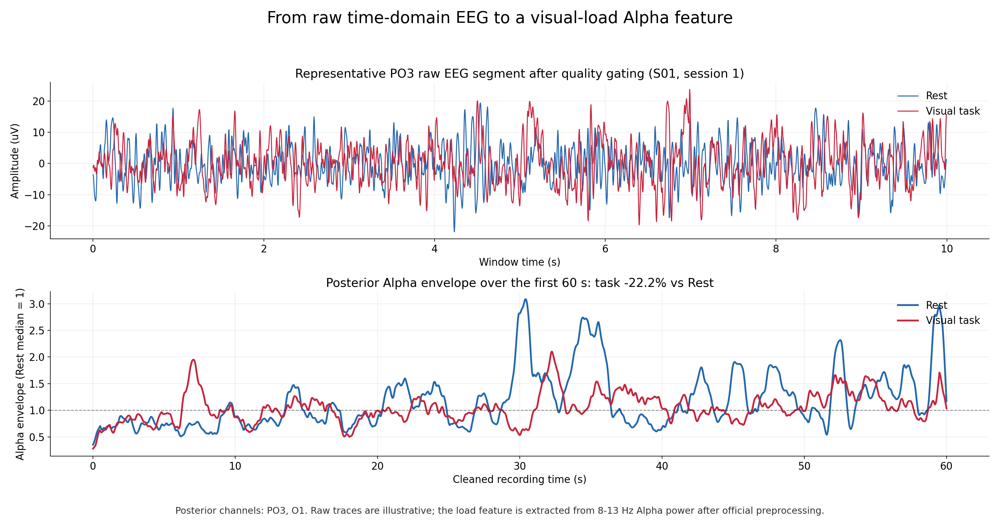
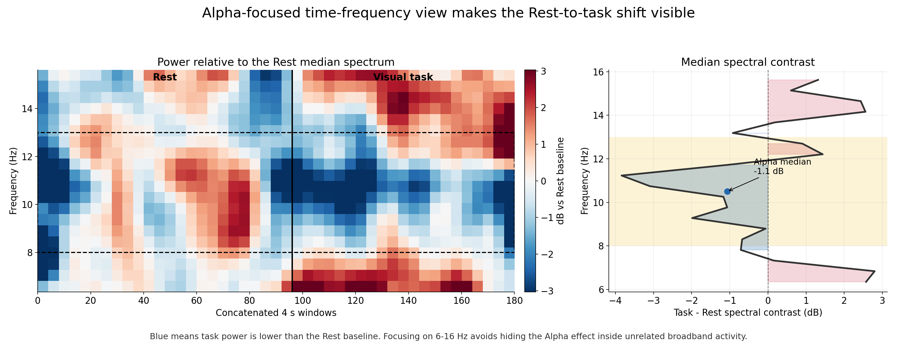
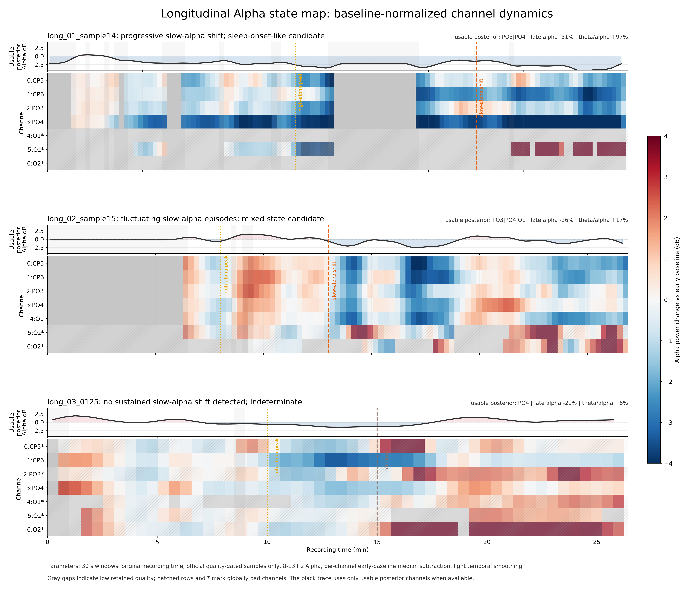

# NeuraDock Visual Cognitive Load Dataset

> A small, public EEG dataset for building visual cognitive-load features that
> remain interpretable during real-world long recordings.

This folder is designed as a complete tutorial benchmark for the NeuraDock
7-channel EEG workstation. It starts with short Rest/Task recordings for
posterior Alpha-based visual-load analysis, then adds three complete long
recordings to test whether the same feature is confused by eyes-closed rest,
meditation-like quiet state, drowsiness, near-sleep transition, or signal
quality changes.

The central question is:

> When posterior Alpha changes, is it a visual-task effect, or a change in
> baseline state?

## What Users Can Do With This Dataset

| Goal | Data to use | Expected output |
|---|---|---|
| Parse NeuraDock raw text | All `.txt` files | `7 x samples` EEG array at 250 Hz |
| Check device/data quality | Raw files + quality figures | Bad channels, retained windows, usable posterior channels |
| Build visual-load features | Paired Rest/Task recordings | Within-subject posterior Alpha index |
| Stress-test false positives | Three long recordings | Candidate state markers and abstention/recalibration rules |
| Demonstrate long recording performance | 26-61 min raw exports | Continuous Alpha tracking across naturalistic sessions |

Use each person as their own baseline. Do not compare absolute Alpha or
cognitive-load scores across people without a separate calibration protocol.

## Dataset At A Glance

| Component | Contents | Role |
|---|---:|---|
| Paired Rest/Task cohort | 12 raw recordings, 3 subjects, 2 sessions | Controlled visual-load comparison |
| Task-variant cohort | 6 raw recordings, 2 subjects | Chat, music, game, rest, and mixed eye-state caveats |
| Longitudinal-state cohort | 3 complete raw recordings, 26-61 min | Meditation-like, drowsy, near-sleep, and stable-rest confound testing |
| Homepage figures | 3 PNG result summaries + provenance | Quick visual validation for GitHub readers |
| Derived tables | manifests, checksums, quality/state CSVs | Reproducibility and data integrity |

Raw data are in [mini_dataset_v20260622](mini_dataset_v20260622/). Dataset scope
and limitations are described in [DATASET_CARD.md](DATASET_CARD.md). Figure
sources and display parameters are in [figures/README.md](figures/README.md).

## Core Result 1: Raw EEG To Alpha Feature



The top panel shows a representative quality-retained raw EEG segment. The
bottom panel converts that signal into a posterior 8-13 Hz Alpha envelope. This
is the basic cognitive-load feature: compare task Alpha against that person's
own Rest baseline, not against another subject.

## Core Result 2: Rest/Task Spectral Evidence



The selected paired session shows a quality-gated posterior Alpha decrease
during the visual task. Across all six Rest/Task pairs, the most interpretable
example is `S01` session `1`, with median 4 s posterior Alpha power `22.2%`
lower in task than Rest after official preprocessing.

## Core Result 3: Long Recording State Map



Each row is one EEG channel in 30 s windows. Red means stronger Alpha and blue
means weaker Alpha relative to that channel's early baseline. The black trace
uses usable posterior channels when available. Gray gaps indicate low retained
quality, while hatched rows and `*` mark globally bad channels.

This is the most important story in the dataset: the same Alpha feature that is
useful for visual-load analysis can also change during quiet rest, meditation,
drowsiness, and near-sleep transition. A robust system should detect those
confounds and report `indeterminate / recalibrate` instead of inventing a
cognitive-load score.

## Long Recordings: State Candidates, Not Clinical Labels

The long files are complete raw exports and are deliberately not split. They are
useful because they show what happens when the device is worn continuously
outside short task blocks.

| Recording | Duration parsed | Usable posterior channels | Automatic candidate pattern | Why it matters |
|---|---:|---|---|---|
| `long_01_sample14` | 60.96 min | PO3, PO4 | Progressive slow-Alpha shift; sleep-onset-like candidate from 45 min | Tests near-sleep / drowsiness false positives |
| `long_02_sample15` | 53.74 min | PO3, PO4, O1 | Fluctuating slow-Alpha episodes; mixed-state candidate from 26 min | Tests meditation-like or half-awake state changes |
| `long_03_0125` | 26.42 min | PO4 | No sustained slow-Alpha shift; indeterminate | Useful negative-control style recording, but low confidence because only one posterior channel remains |

These labels are automatic engineering candidates derived from Alpha,
theta/Alpha, delta/Alpha, and quality retention. They are not verified sleep
stages, meditation labels, or medical annotations. If session notes are
available, they should be added as separate metadata before using the long
recordings as behavioural labels.

## What This Shows About Device Performance

This dataset is not a formal hardware specification, but it does provide public
evidence for several practical device capabilities:

- **Raw export stability:** complete Bluetooth text recordings are included,
  including three long raw files up to about one hour.
- **Posterior Alpha visibility:** Rest/Task and long-state examples show
  recoverable 8-13 Hz posterior Alpha dynamics after quality gating.
- **Quality transparency:** the analysis reports bad channels, retained
  windows, and usable posterior electrodes instead of hiding poor segments.
- **Longitudinal tracking:** 30 s Alpha maps show state changes over tens of
  minutes, including drowsy or near-sleep candidates.
- **Reproducibility:** manifests, SHA-256 checksums, figure provenance, and
  derived CSV tables are provided with the raw files.

## Recommended Workflow

1. Load one person's Rest recording and run the official parser and preprocessing.
2. Check bad channels and retained windows before computing any feature.
3. Compute posterior Alpha power from usable posterior channels.
4. Compare task windows against the same person's Rest baseline.
5. Inspect the long recordings to design `quality fail`, `state confound`, and
   `recalibrate` rules.
6. Report automatic long-state markers as candidates unless external session
   notes or scored annotations are available.

The processing format follows the examples in
[Neuradock/eeg-workstation-python](https://github.com/Neuradock/eeg-workstation-python/tree/main/examples),
including Bluetooth text parsing, offline preprocessing, quality gating, and
Alpha-band analysis.

## Repository Layout

```text
visual_cognitive_load/
|-- README.md                         # This GitHub landing page
|-- DATASET_CARD.md                   # Intended use, non-use, and limitations
|-- figures/                          # Homepage figures, provenance, derived feature CSVs
`-- mini_dataset_v20260622/           # Downloadable raw-data bundle
    |-- cohort_3subj_rest_task/        # Paired controlled Rest/Task sessions
    |-- cohort_2subj_ljw_xzy/          # Chat, music, game, and Rest variants
    `-- longitudinal_state/            # Three complete long raw recordings + analysis
```

Start with [mini_dataset_v20260622/README.md](mini_dataset_v20260622/README.md)
for file names and example commands. Use
[longitudinal_state/README.md](mini_dataset_v20260622/longitudinal_state/README.md)
for the long-recording marker policy and
[STATE_DYNAMICS_REPORT.md](mini_dataset_v20260622/longitudinal_state/analysis/STATE_DYNAMICS_REPORT.md)
for the current automatic interpretation.

## Interpretation Boundary

This is an engineering and research dataset. It supports reproducible
feature-extraction, quality-control, within-subject cognitive-load experiments,
and long-recording robustness tests. It does not provide clinical sleep staging,
diagnosis, meditation classification, or cross-subject absolute cognitive-load
scores.
